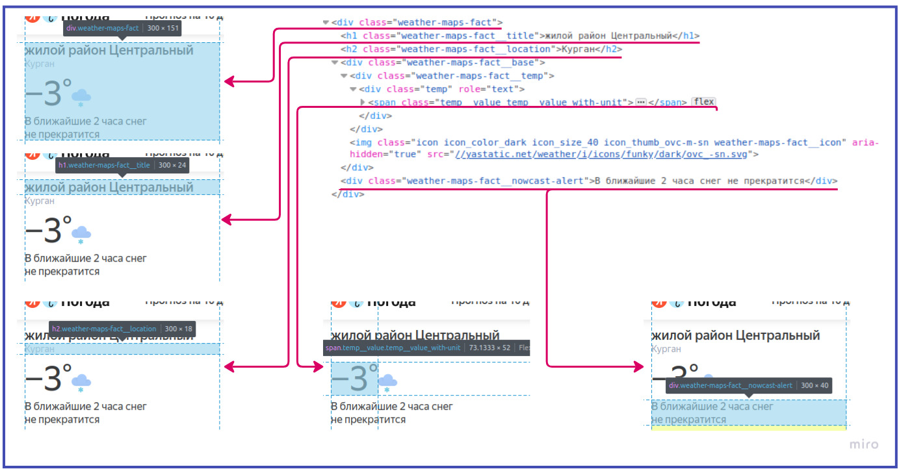
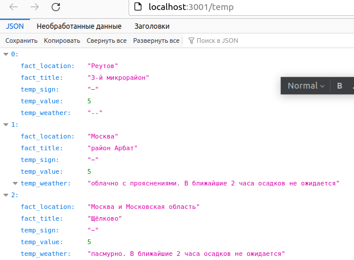
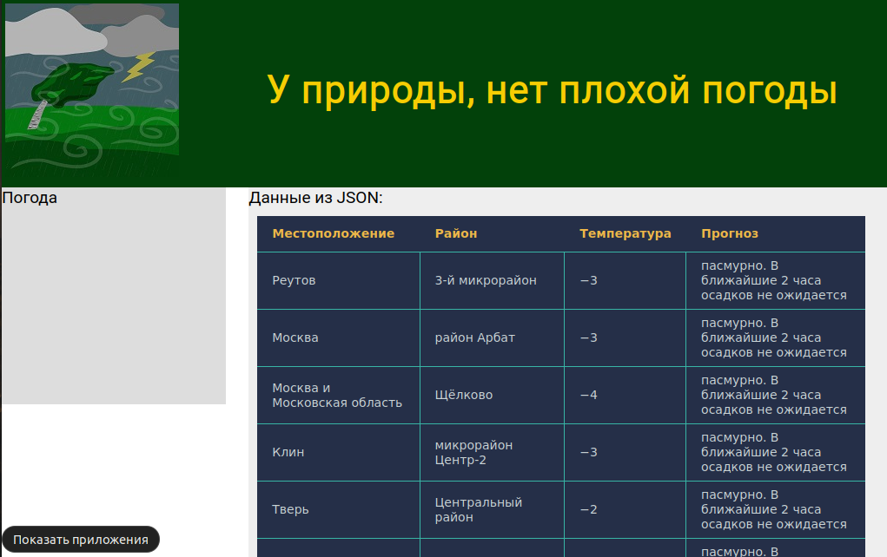

## Пример парсинга сайта погоды ##
По мотивам:
[Парсинг сайта вместе с Python и библиотекой Beautiful Soup: простая инструкция в три шага](https://skillbox.ru/media/code/parsing-sayta-vmeste-s-python-i-bibliotekoy-beautiful-soup-prostaya-instruktsiya-v-tri-shaga/)  
Данная ссылка не совсем актуальна, т.к. теги чуть-чуть изменились.   
**Цель** научиться автоматически собирать информацию с сайтов, а также закрепить навык работы с файлами JSON.  
Конечно, у подобных сайтов погоды, можно найти API, но, мы не ищем легких путей.  
Но, это не точно...
### **Что планирую сделать** ###
- [X] Создать JSON файл (`coordinates.json`) с координатами (широта (_анг. latitude_), долгота (_анг. longitude_))
    - [X] Файл создан вручную.  
    - [X] Структура файла имеет вид: 
```json 
  {"coordinates": [
                  {"latitude": 55.75271126516939, "longitude": 37.620075222783065},
                  {"latitude": 55.74728945111273, "longitude": 37.58883285217758},
                  {"latitude": 55.918603270567644, "longitude": 37.99781588879381}
                   ]
  }
  ``` 
- [X] `main.py` считывает координаты из `coordinates.json`
- [X] `main.py` в цикле: 
    - [X] формирует ссылку для запроса согласно полученным координатам
    - [X] получаем необходимые данные (_см. ниже_), сохраняя в список словарей
- [X] записываем в `temperature.json` полученный словарь:
```json
{
  "temp": [
            {
              "fact_location": "Омск",
              "fact_title": "Кировский округ",
              "temp_sign": "+",
              "temp_value": "15",
              "temp_weather": "малооблачно. В ближайшие 2 часа осадков не ожидается"
            },
          ...
          ]
}
```
- [ ] Создаём статичную страничку `index.html`
- [X] С помощью JavaScript выводим полученный результат в `index.html`
  - [X] Необходимо установить JSON-сервер, чтобы отдавать в html документ json.
### Парсим температуру окружающей среды ###  
Ссылка для парсинга (пример): [https://yandex.com.am/weather/maps/nowcast?via=mmapwb&le_Lightning=1&ll=37.640675_55.752808&z=13&lat=55.75271126516939&lon=37.620075222783065](https://yandex.com.am/weather/maps/nowcast?via=mmapwb&le_Lightning=1&ll=37.640675_55.752808&z=13&lat=55.75271126516939&lon=37.620075222783065)  
Можно сократить до вида:[https://yandex.com.am/weather/maps/nowcast?&lat=55.75271126516939&lon=37.620075222783065](https://yandex.com.am/weather/maps/nowcast?&lat=55.75271126516939&lon=37.620075222783065)  

На странице сайта интересен этот код:
 ``` html
 <div class="weather-maps-fact">
    <h1 class="weather-maps-fact__title">Тверской район</h1>
    <h2 class="weather-maps-fact__location">Москва</h2>
    <div class="weather-maps-fact__base">
      <div class="weather-maps-fact__temp">
        <div class="temp" role="text">
          <span class="temp__value temp__value_with-unit">−4</span>
        </div>
      </div>
    </div>
    <div class="weather-maps-fact__nowcast-alert">облачно с прояснениями. В ближайшие 2 часа осадков не&nbsp;ожидается</div>
 </div>
 ```
Поясняющая схема:  
  
Используем функцию ```find()```, которая принимает два аргумента:
+ указание на тип элемента HTML-кода, в котором происходит поиск;
+ наименование этого элемента.

В ```txt```сохраняем код всей страницы, затем находим заинтересовавший нас участок кода и заносим его в
в словарь:
+ ```rez["fact_location"]``` -
+ ```rez["fact_title"]``` -
+ ```rez["temp_sign"]``` - знак положительной или отрицательной температуры
+ ```rez["temp_value"]``` - температура в Цельсиях.
+ ```rez["temp_weather"]``` -  погода (дождь, солнечно...) 

Удаление `\xa0` - неразрывного пробела.
```python
        temp_weather = txt.find('div', 'weather-maps-fact__nowcast-alert').text
        rez["temp_weather"] = " ".join(temp_weather.split())
``` 
Экспериментальным путём при записи значения ключа `rez["temp_weather"]`, 
было выявлено значение, равное `None`, с последующей ошибкой. Предполагаю, что на сайте, проводилось какое-то 
обновление и где-то, что-то не подтянулось. Проблема наблюдалась в районе 1-2 минут.  
Устраняем проблему, в случае ошибки в словарь пишем `"--"`:
```python
        try:
            temp_weather = txt.find('div', 'weather-maps-fact__nowcast-alert').text
            rez["temp_weather"] = " ".join(temp_weather.split())
        except Exception as e:
            rez["temp_weather"] = "--"
            logging.warning(f" Отсутствует значение у ключа rez['temp_weather']. \n {e}\n{url}")
<div class="temp" role="text"><span class="temp__value temp__value_with-unit"><span class="temp__sign">+</span><span class="temp__value">13</span></span></div>
```

### Вывод в html страничку. ###  
#### Необходимо установить JSON-сервер. ####  
Обновим локальный индекс пакетов (для Ubuntu):
```
~$ sudo apt update
```
Установим Node js репозиторий:
```
~$ sudo apt install nodejs
```
Затем установим менеджер пакетов npm:
```
~$ sudo apt install npm
```
Проверим работоспособность программ командами:
```
~$ nodejs -v
~$ npm -v
```
Устанавливаем JSON Server:
```
 ~$  sudo npm install -g json-server
```
Запуск JSON-сервера:
```
json-server  temperature.json –w --port 3001
```
* Проверяем: http://localhost:3001/temp
Должно, получиться, нечто подобное:  
  
* Открываемl локальную страничку _index.html_:  
 

### Используемый материал ###
+ [Контекстные Менеджеры в Python](https://python-scripts.com/contextlib)
+ [JSON в Python](https://python-scripts.com/json)
+ [Работа с файлами в формате JSON](https://pyneng.readthedocs.io/ru/latest/book/17_serialization/json.html)
+ [Python: Логируем как профессионалы](https://habr.com/ru/company/otus/blog/590067/)
+ [Как установить Node.js на Ubuntu](https://help.reg.ru/support/servery-vps/oblachnyye-servery/ustanovka-programmnogo-obespecheniya/kak-ustanovit-node-js-na-ubuntu)
+ [ typicode / json-server ](https://github.com/typicode/json-server)
+ [Знакомство с REST API и форматом JSON / YOUTUBE ](https://www.youtube.com/watch?v=sUsTbcVGvMM)